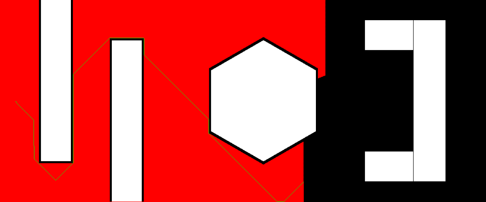

# Point-Robot-Dijkstra
Solving point robot by Dijkstra's algorithm

## Dependencies
- numpy
- tqdm
- heapq
- opencv-python
- argparse

## Usage
Please set the initial and goal coordinates between x:1 to 1200 and y:1 to 500. You can use `--InitNode x_y` and `--GoalNode x_y` to set the start and goal Node


Use the following command to run the code, it sets the initial node at (400, 250), and the goal node at (1200, 250)
```
python3 dijkstra_Yi-Chung_Chen.py --InitNode 400_250 --GoalNode 1200_250
```
If you set invalid coordinates (in the obstacles or out of boundary), the code will raise an error ***Sorry, this is an invalid coordinate (coordinate is out of the map or in the obstacles)***

## Visualization
The figure below shows the result of this code. You can also find the videos at [here](https://drive.google.com/file/d/1WX6XRF0-ON4v6DaSZo4iLhbA2cfJfWqd/view?usp=sharing).


